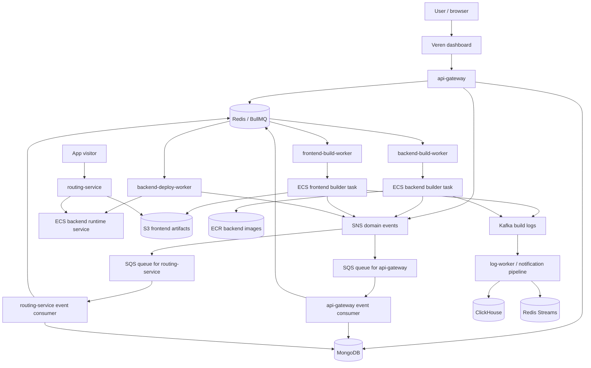
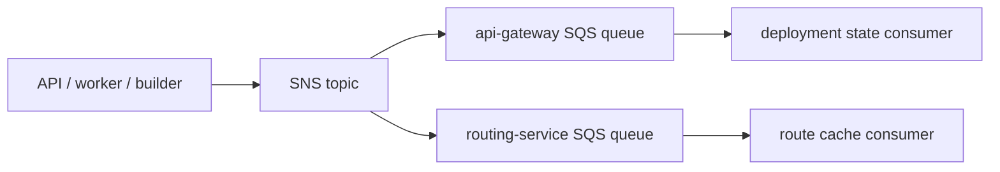

# Veren Architecture

Veren is a service-oriented deployment platform. The API gateway accepts user
intent, workers convert that intent into cloud build/deploy actions, domain
events keep services synchronized, and the routing service sends public traffic
to the correct deployed application.

The platform is intentionally split into smaller responsibilities. A request to
"deploy this repo" should not require the API process to clone repositories,
build containers, upload artifacts, and manage live routing. Veren turns that
request into a coordinated workflow.

## Product Principle

The platform is designed around one strong product opinion: a deployed app
should not feel asleep.

Many student-friendly or free-tier deployment experiences optimize hard for
cost by scaling applications down when nobody is using them. That is rational
for the provider, but painful for the person sharing the link. The first visitor
does not see "cost optimization"; they see a project that appears slow, broken,
or unavailable.

Veren takes the opposite side of that tradeoff for backend deployments. Once a
backend is deployed, the runtime service stays up. There is no deliberate
cold-start pause before the first request. That decision creates more platform
work: Veren must manage ECS services, runtime routing, public IP discovery,
updates, and failure handling. But it also makes the deployed application feel
real the moment someone opens it.

## System Overview



## Core Building Blocks

### API Gateway

The API gateway is the user-facing control service. It owns GitHub OAuth,
project creation, environment variables, deployment creation, webhook handling,
and deployment state updates from domain events.

It does not perform builds itself. When a deployment starts, it creates a
`Deployment` document, links it to the `Project`, and adds a job to the correct
BullMQ queue:

- frontend projects go to `frontendBuildQueue`
- backend projects go to `backendBuildQueue`

After backend image builds succeed, the API event consumer adds another job to
`backendDeployQueue`.

### Domain Package

`packages/domain` is the shared contract package. It contains the MongoDB models
for users, projects, and deployments, plus deployment event enums and the SNS
publisher.

This package matters because multiple services need to agree on the same event
names and document shape. When you add a new lifecycle state, start here and
then update the consumers that react to it.

### Workers

Workers are queue consumers. They are intentionally thin:

- Build workers validate job payloads and start ECS/Fargate builder tasks.
- The backend deploy worker registers ECS task definitions, creates or updates
  backend services, waits for a running task, and extracts the public IP.

The workers are not where user application code is built. They start isolated
builder containers so heavy work does not run inside the control plane.

### Builder Images

Builder images are the runtime environments used by ECS/Fargate build tasks.

The frontend builder clones a repository, runs install/build commands, uploads
the output directory to S3, publishes logs to Kafka, and publishes a success or
failure domain event.

The backend builder clones a repository, prepares a Docker build context, uses
Kaniko to build the application image, pushes that image to ECR, publishes logs,
and publishes a backend build event.

### Routing Service

The routing service is the public traffic layer. It inspects the request
hostname and decides whether the visitor wants a frontend or backend app.

For frontend projects, a hostname like `myapp.veren.site` resolves to a project
ID and proxies the request to S3 under that project's artifact folder. For
backend projects, a hostname like `api.myapp.veren.site` resolves to the public
IP of the ECS backend service and proxies traffic to it.

Redis is the fast route cache. MongoDB is the fallback when a route is missing
from cache.

### Logs

Build containers publish structured log messages to Kafka. The log worker
consumes those messages, writes durable rows to ClickHouse, and keeps a small
recent buffer in Redis Streams for live views.

Logs are separate from deployment state. Deployment state answers "where is this
deployment in the lifecycle?" Logs answer "what happened while it was building?"

## Architecture Decisions And Tradeoffs

This section explains why Veren uses certain pieces, not only what those pieces
are. The goal is to make the architecture reviewable. Every choice here bought
something and cost something.

### Redis-First Routing With MongoDB Fallback

The routing service reads route targets from Redis first because routing is on
the request path. Every deployed app visitor goes through this service, so the
common case should be fast and cheap: hostname in, route target out.

MongoDB is still kept as the fallback because Redis alone is not the source of
truth. Cache entries can disappear, deployments can outlive a Redis restart, and
route state needs to be recoverable from durable project metadata. The fallback
also makes local debugging easier: if a route key is missing, the system can
rebuild it from the project document instead of failing immediately.

The tradeoff is duplicated state. A backend public IP can exist in Redis and in
MongoDB. That means route consumers must keep both updated, and debugging has to
check whether a failure is caused by deployment state, cache state, or fallback
state. Veren accepts that complexity because request-time routing should not
depend on a database query for every visitor.

### ECS Services Instead Of Scale-To-Zero Backends

Veren keeps deployed backend services running. This is the emotional and
technical reason the project exists: shared links should open immediately.

The tradeoff is cost. A service that never scales to zero consumes resources
even when nobody is using it. For a student platform, that is not the cheapest
possible design. It also means the platform has to manage service updates,
running task discovery, networking, and route cache updates.

The benefit is a better deployed-app experience. Veren chooses predictable
availability over the free-tier cold-start pattern.

### Avoiding Too Much Managed Platform Magic

Veren uses AWS primitives, but the platform still owns a lot of orchestration
itself: queues, workers, builder images, event consumers, routing, and log
storage. A more managed design could push more of this work into higher-level
AWS services or a commercial deployment platform.

The reason for keeping more of it visible is cost control and learning value.
Owning the flow makes the deployment pipeline understandable end to end: the
project record, queue job, ECS task, builder image, event, log stream, and route
update are all visible pieces.

The cost is operational surface area. More owned pieces means more places where
retries, permissions, networking, and observability need to be handled. Veren is
therefore a learning-oriented platform architecture, not a claim that every
piece is the simplest production choice.

### Kaniko Over Docker-In-Docker

Backend builds use Kaniko because the platform needs to build container images
inside isolated builder containers without depending on a privileged Docker
daemon. Docker-in-Docker can work, but it increases the security and operational
burden: privileged containers, daemon lifecycle, socket exposure, and a larger
blast radius if the build environment is compromised.

Kaniko fits the builder-task model better. The backend builder receives a build
context, creates an image, and pushes it to ECR without needing a nested Docker
daemon.

The tradeoff is flexibility. Docker-in-Docker can feel more familiar and may
support some workflows more directly. Kaniko requires the build context and
Dockerfile behavior to stay compatible with its execution model.

### Kafka For Logs, Even Though Scale Does Not Demand It Yet

Kafka is used for build logs, but not because Veren currently needs massive log
throughput. The honest reason is that Kafka provides a useful learning and
replay model: builder containers can publish logs to a durable stream, and a log
worker can consume them into ClickHouse and Redis Streams.

That is valuable because logs are not just console output. They are part of the
deployment experience. A user should be able to inspect what happened during a
build, and a developer should be able to replay or reprocess logs when the log
consumer changes.

The tradeoff is complexity. Kafka adds credentials, certificates, topics,
consumer groups, and failure modes. For the current scale, Redis Streams alone
could be simpler. Veren keeps Kafka because it makes the logging path more
serious and teaches the platform how durable event streams behave, but the docs
should be honest: this is a deliberate learning and architecture choice, not a
scale requirement.

## Data Model

### Project

A project represents a GitHub repository configuration owned by a user. It
contains:

- a unique project name
- project type: `frontend` or `backend`
- Git repository URL and branch
- entry directory inside the repository
- frontend or backend build commands
- environment variables
- generated Veren subdomain
- deployment references
- routing metadata such as backend IP

The project is long-lived. Deployments are created under it.

### Deployment

A deployment is one attempt to build and publish a project. It contains:

- project and owner IDs
- deployment number
- current status
- started and finished timestamps
- build/deploy task identifiers
- backend image URL
- artifact URL fields
- error details when the lifecycle fails

The persisted deployment status is intentionally compact:

```txt
queued
building
deployed
failed
```

Domain events are more specific than the stored status because they represent
the exact lifecycle moment that caused the state update.

## Event Model

Veren uses deployment domain events so services do not need to call each other
directly for every lifecycle change.



Important events include:

```txt
CREATED
FRONTEND_BUILD_QUEUED
FRONTEND_BUILD_SUCCESS
FRONTEND_BUILD_FAILED
BACKEND_BUILD_QUEUED
BACKEND_BUILDING
BACKEND_BUILD_SUCCESS
BACKEND_BUILD_FAILED
BACKEND_DEPLOY_QUEUED
BACKEND_DEPLOYING
BACKEND_DEPLOYED
BACKEND_DEPLOY_FAILED
INTERNAL_ERROR
```

The API consumer updates deployment records and may enqueue backend deployment
work. The routing consumer updates route cache and backend IP metadata after
successful deployments.

## Request-Time Routing

Routing is intentionally simple:

1. Read the hostname.
2. If the first hostname segment is `api`, treat it as a backend request.
3. Otherwise treat it as a frontend request.
4. Look up the target in Redis.
5. If Redis misses, fall back to the project record in MongoDB.
6. Proxy to S3 for frontend assets or to the backend public IP for API traffic.

This means routing correctness depends on successful event consumption. If a
deployment succeeds but routing does not work, check the event consumer and the
Redis route keys before assuming the build failed.

## Known Limitations And Tradeoffs

Veren is intentionally documented with its rough edges. Hiding the tradeoffs
would make the system look cleaner than it is and less useful to maintain.

### API Gateway Owns Too Much

The API gateway currently owns authentication, project management, deployment
creation, webhook handling, environment variables, queue enqueueing, and event
state reconciliation. That is acceptable for this stage because it keeps the
control plane easy to run and inspect.

At larger scale, this should split into clearer services:

- auth/session service
- project configuration service
- deployment coordinator
- webhook receiver
- deployment state/event consumer

The reason it has not been split yet is practical: premature service splitting
would add deployment overhead before the boundaries are proven.

### BullMQ And SNS/SQS Overlap

Veren uses BullMQ for work queues and SNS/SQS for domain events. This is a
reasonable split conceptually: queues assign work, events announce facts. But it
does create overlapping failure surfaces. A deployment can fail because the job
did not run, because an event was not published, because SQS was not consumed,
or because state was not updated after the event.

The production direction would be to add stronger correlation IDs, dead-letter
queues, replay tooling, and dashboards that show the job/event pair for a
deployment. Another possible direction is consolidating more of the lifecycle
onto one eventing model once the workflow is stable.

### Failure Recovery Is Still Thin

Veren currently keeps the lifecycle simple:

- BullMQ jobs use low retry counts.
- Completed and failed jobs are removed.
- Rollback methods exist as placeholders.
- The API stores broad deployment status, while detailed progress is event/log
  driven.

For production hardening, the next improvements should be dead-letter queues,
preserved failed jobs, retries around AWS/SQS/Kafka operations, and correlation
IDs across logs, events, and deployment records.

### Warm Services Cost More

Avoiding cold starts means backend services keep running. That is a real cost.
For hobby usage, scale-to-zero is cheaper. Veren chooses warm availability
because the product goal is to make shared deployed apps feel ready immediately.

If cost became the highest priority, the platform would need autoscaling rules,
idle detection, scheduled suspension, or a hybrid mode where users choose
between always-on and sleep-after-idle deployments.
