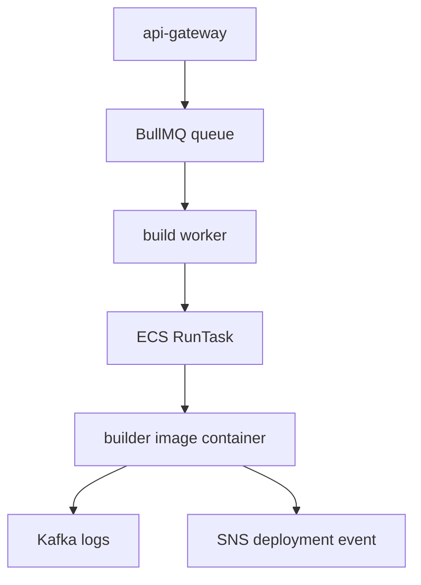

# Builder Images And ECS Task Mapping

Builder images are the execution environments that build user projects. Workers
start these images as ECS/Fargate tasks. The tasks do the work, publish logs,
and emit final deployment events.

This split is important: workers should be small and predictable, while builder
containers can handle repository-specific install/build behavior in isolation.

## Worker To Builder Flow



The worker passes configuration through ECS container environment overrides.
That lets the same task definition build many different projects.

## Frontend Builder

Source:

```txt
BUILDER_IMAGES/builder-image-frontend/
```

Used by:

```txt
WORKERS/frontend-build-worker/
```

The frontend worker selects an ECS task definition based on the requested Node
version. The current worker supports Node `18` and `20` paths through
`frontendConfig18` and `frontendConfig20`.

The frontend builder receives:

```txt
GIT_REPOSITORY__URL
PROJECT_ID
DEPLOYMENTID
FRONTENDPATH
FRONTENDOUTPUTDIR
BUILDCOMMAND
INSTALLCOMMAND
AWS_ACCESS_KEY_ID
AWS_SECRET_ACCESS_KEY
KAFKA_CLIENT_ID
KAFKA_BROKER1
KAFKA_SASL_USERNAME
KAFKA_SASL_PASSWORD
DOMAIN_EVENTS_TOPIC_ARN
```

Project environment variables are appended to the ECS environment override.

What the frontend builder does:

1. Clone the GitHub repository.
2. Enter the configured frontend path.
3. Run the install command.
4. Run the build command.
5. Upload the configured output directory to S3.
6. Publish build logs to Kafka.
7. Publish frontend success or failure event.

The routing service later serves files from the S3 output folder using the
project ID.

## Backend Builder

Source:

```txt
BUILDER_IMAGES/build-image-backend/
```

Used by:

```txt
WORKERS/backend-build-worker/
```

The backend builder receives:

```txt
GIT_REPOSITORY__URL
NODE_VERSION
INSTALL_COMMAND
RUN_COMMAND
PROJECT_ID
DEPLOYMENTID
BACKEND_PATH
ECR_URI
AWS_ACCESS_KEY_ID
AWS_SECRET_ACCESS_KEY
AWS_REGION
KAFKA_CLIENT_ID
KAFKA_BROKER1
KAFKA_SASL_USERNAME
KAFKA_SASL_PASSWORD
DOMAIN_EVENTS_TOPIC_ARN
```

What the backend builder does:

1. Clone the GitHub repository.
2. Enter the configured backend path.
3. Choose a Dockerfile template for the selected Node version.
4. Build the backend image with Kaniko.
5. Push the image to ECR.
6. Publish build logs to Kafka.
7. Publish backend build success or failure event.

The backend image tag is then used by the backend deploy worker.

## Backend Runtime Deploy

The backend deploy worker does not use a builder image. It consumes the image
produced by the backend builder and creates or updates an ECS service for the
project.

It receives:

```txt
deploymentId
projectId
imageTag
installCommand
startCommand
envs
```

It creates an ECS task definition with:

- image from `imageTag`
- `NODE_ENV=production`
- `PORT=80`
- `FRONTEND_URL`
- `START_CMD`
- non-reserved project environment variables

Then it waits for the ECS service to run and extracts the task public IP.

## ECS Configuration

The worker-side ECS configuration comes from environment variables:

```env
AWS_FRONTEND_CLUSTER=...
AWS_BACKEND_CLUSTER=...
TASK18=...
TASK20=...
TASKBACKEND=...
FRONTEND18CONTAINER=...
FRONTEND20CONTAINER=...
BACKEND_CONTAINER=...
AWS_SUBNETS=subnet_a,subnet_b
AWS_SECURITY_GROUPS=sg_x
```

The worker uses these values to call `RunTaskCommand` with a container
environment override.

## Logs And Events From Builders

Builder logs and deployment events serve different purposes:

- Kafka logs explain what happened inside the build.
- SNS deployment events tell the platform what state transition happened.

A successful frontend build should publish logs and then
`FRONTEND_BUILD_SUCCESS`. A successful backend build should publish logs and then
`BACKEND_BUILD_SUCCESS` with an image tag payload.

If logs are present but the deployment status never changes, inspect the domain
event publisher or SQS consumers. If status changes but logs are missing,
inspect Kafka and the log worker.

## Updating Builder Images

When changing a builder image:

1. Update the files under `BUILDER_IMAGES`.
2. Build the image locally.
3. Push it to the registry used by the ECS task definition.
4. Update task definitions if the image tag or container name changed.
5. Verify the worker environment still points to the right task definition.
6. Run one real frontend or backend deployment and check logs/events.

Do not change builder behavior without checking the corresponding worker,
because the worker and builder communicate through environment variable names.